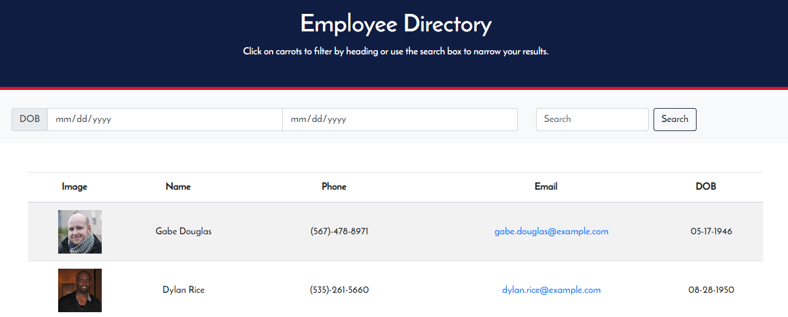
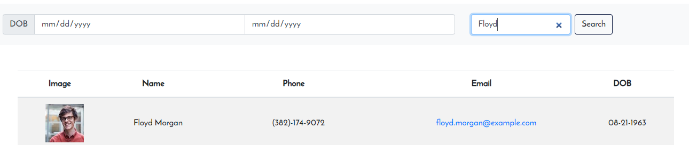

# Employee Directory

This application is a webpage that utilizes the randomuser API. It uses React as its Front End to create a responsive components. Random user are displayed on the main page. A user can interact with the filters to filter through random users.

## Built With

* React
* Node
* JavaScript
* HTML/CSS

## Pages

### Front Page

The only page on the application.

### Search

User can search and person by name or filter by birth date.

https://chaselipscomb.github.io/reacthw/